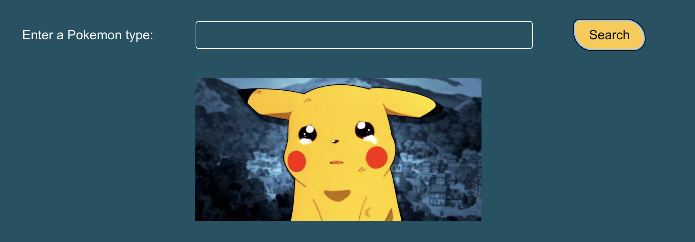

# Poke Pals App

#### To access the app on your browser, follow this URL:

> https://pokeapals.netlify.app/

## Skills

- **JavaScript**
- **React**
- **Vite**
- **HTML**
- **CSS**
- **Form Validation**
- **Loading Animations**
- **State**
- **useEffect**
- **Fetch**
- **Controlled Components**
- **Conditional Rendering**

## Setup

#### Clone the repository:

> Click the green `Code` button and copy the URL  

#### In your local machine's terminal, run:

> git clone https://github.com/Dimeben/poke-pals.git 

#### Once it has downloaded, run:

> cd /poke-pals  
> code .  

#### To begin, install npm & Node.js by following this link:

[Install npm and Node.js](https://docs.npmjs.com/downloading-and-installing-node-js-and-npm)

> Made using Node.js v22.4.1

#### Install the dependencies by running the following in your terminal:

> npm i

#### Setup the local host using Vite:

> npm run dev

#### Then click on the link that looks like:

> http://localhost:5173/

#### To end the hosting of the app:

> ctrl + c

## Images:

